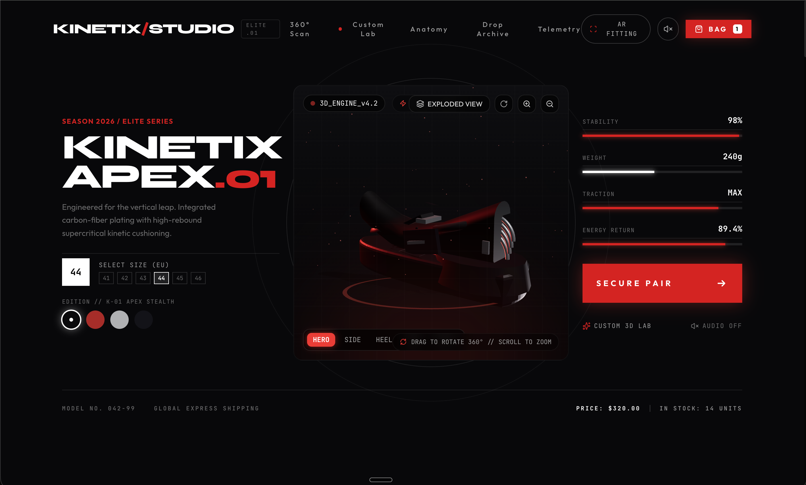

# Kinetix Studio


A premium, interactive 3D web experience for high-performance athletic footwear. Designed with modern web technologies to showcase the "KINETIX APEX.01" shoe series.

## Features

- **Interactive 3D Viewer:** Explore the shoe from every angle, featuring 360-degree rotation and zoom capabilities.
- **Exploded View:** Breakdown the anatomy of the shoe with smooth animations to inspect individual components (cushioning, plate, upper, etc.).
- **Dynamic Customizer Lab:** Configure the colorway of the shoe in real-time.
- **Atmospheric UI:** Dark, high-contrast brutalist design with a focus on immersive red lighting and technical typography.
- **Interactive Sound Design:** Embedded audio engine for UI interactions and chimes, enhancing the premium feel.

## Tech Stack

- **React** (v19)
- **Three.js** & **React Three Fiber** for 3D rendering
- **Framer Motion** for UI animations
- **Tailwind CSS** (v4) for styling
- **Vite** for fast development and bundling

## Getting Started

1. Clone the repository.
2. Install dependencies:
   ```bash
   npm install
   ```
3. Run the development server:
   ```bash
   npm run dev
   ```

## Design Language

Kinetix Studio utilizes a brutalist, industrial aesthetic with clean sans-serif typography, mono fonts for technical details, and a high-contrast dark mode with sharp red accents.
